# Benutzer-Dokumentation der Funktionalitäten von WRAM

## Registrierung und Rollen
Auf der Startseite der Anwendung ist ein Link zur Registrierungsseite hinterlegt.
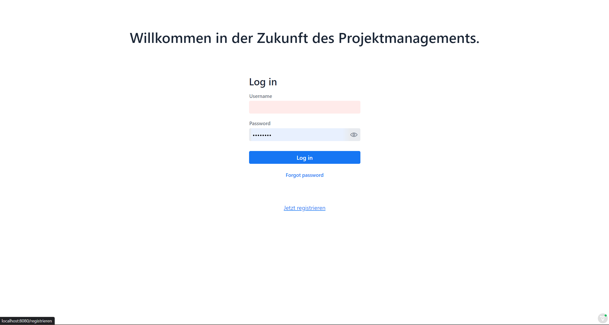
Die Registrierungsseite erlaubt die Eingabe von Vorname, Nachname, Username, E-Mail sowie die Wahl
der Nutzerrolle (hier Entwickler):
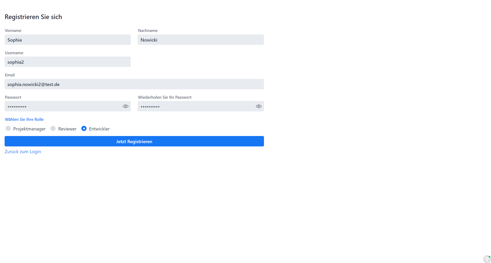
Das Passwort wird dabei auf Übereinstimmung geprüft.
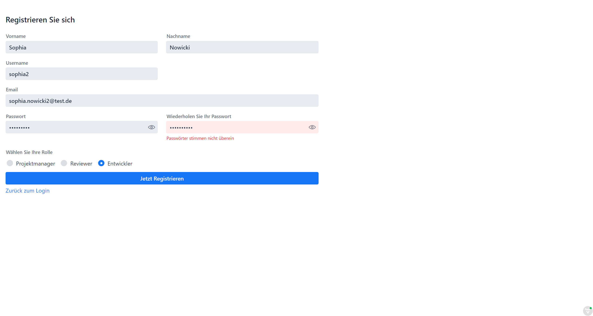

Beachten Sie, dass für eine erfolgreiche Registrierung Ihre angegebene E-Mail verifiziert werden muss.
Nach Ausfüllen und Bestätigen des Registrierungsformulars erhalten Sie eine E-Mail mit einem Link, den Sie aufrufen müssen.
Erst dann können Sie sich erstmalig einloggen.

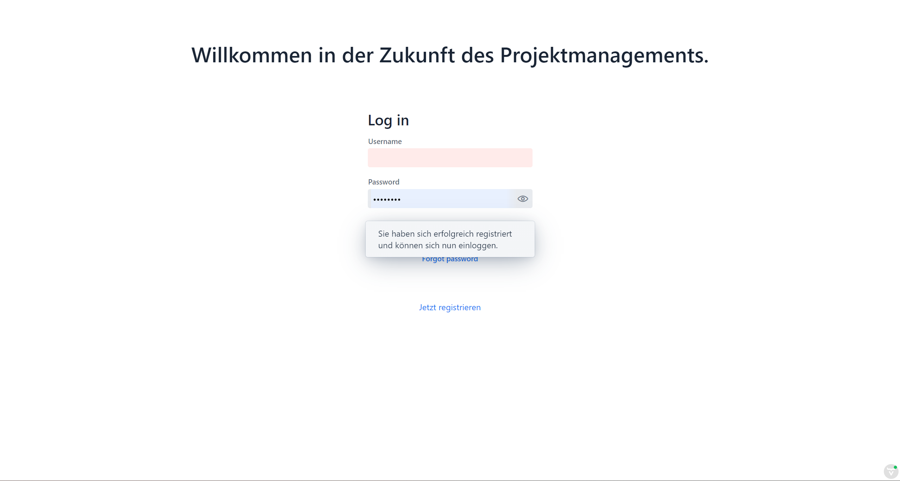

## Login
Der Login erfolgt auf der Hauptseite durch Eingabe des Username und des Passwortes.

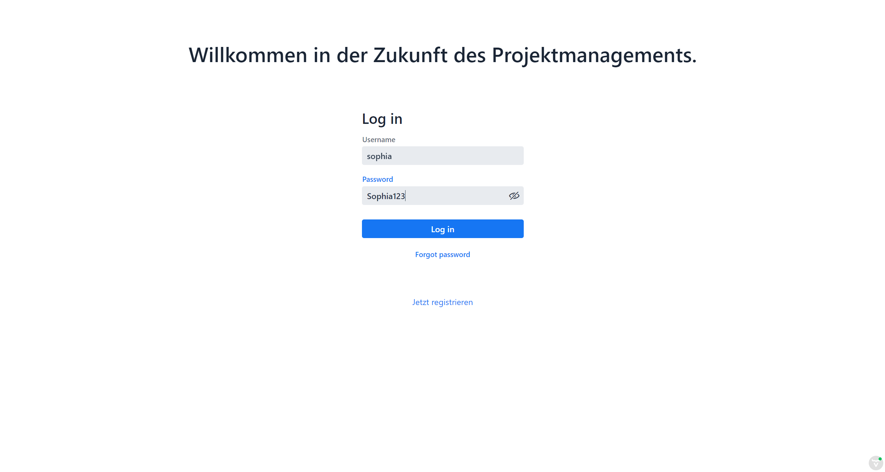

# Funktionalitäten in der Rolle des _Entwicklers_

## Erstellen eines Profils

Da der aktuelle Benutzer sich als Entwickler registriert hat, kann er nun mit Klick auf den Tab "Mein Profile"
sein Profil erstellen bzw. ändern.

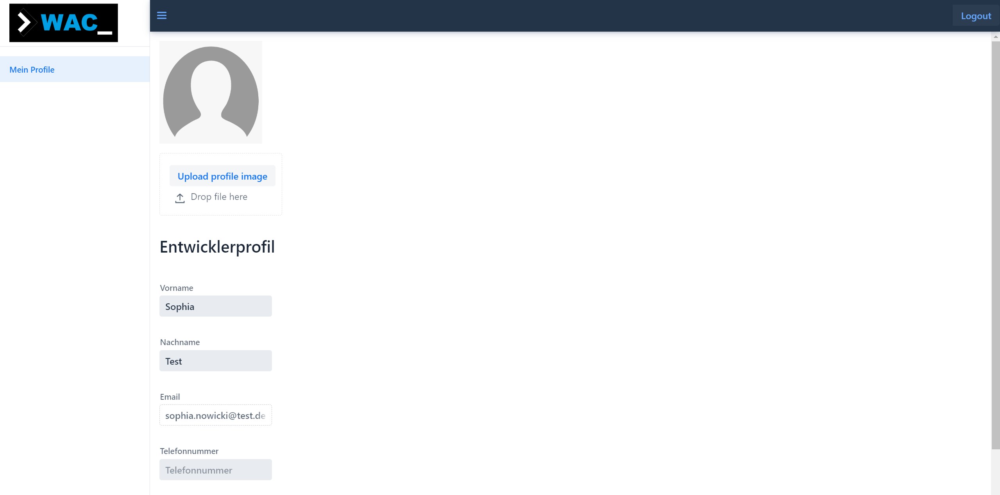

Wie im Screenshot sichtbar werden Daten, die bei der Registrierung angegeben wurden übernommen.
Die E-Mail kann als einziges Feld nicht nachträglich verändert werden.

# Bearbeiten des Profils (für Entwickler)

Wir betrachten nun das Bearbeiten eines Entwicklerprofils. Dem Nutzer ist es möglich alle Felder bis auf die E-Mail-Angabe
zu verändern. Weiterhin kann er/sie **Skills** als Textform **anlegen** und eine **Telefonnummer** sowie ein
**Profilbild** **hinzufügen**.

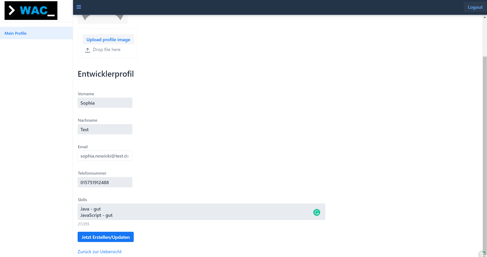

Die Telefonnummer wird dabei auf ein Vorkommen von Buchstaben geprüft: 
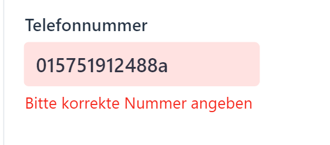
 
Nach Eingabe der Daten können wir nun das Profil abspeichern.

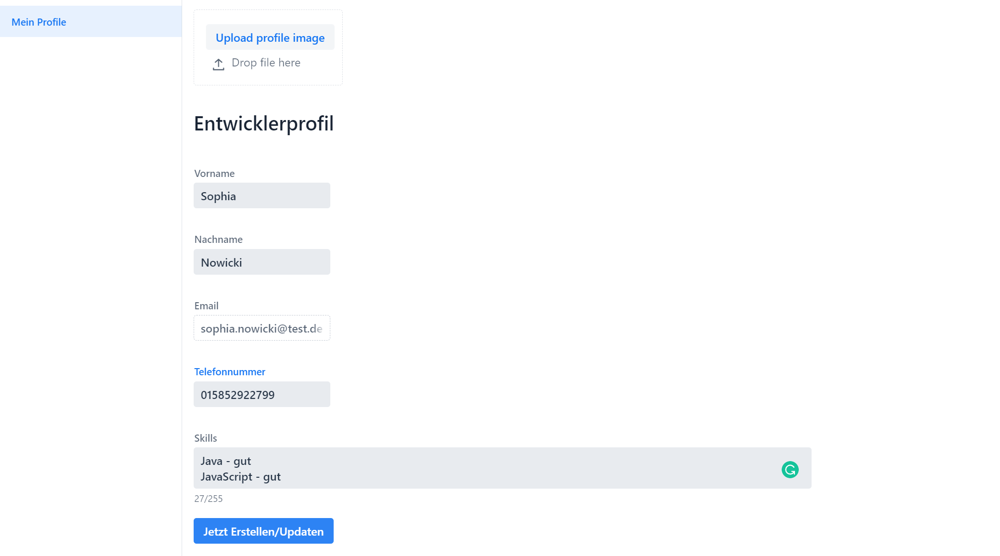
Wir werden bei erfolgreichem Speicher auf die individuelle Landing Page weitergeleitet und werden über das Update informiert:
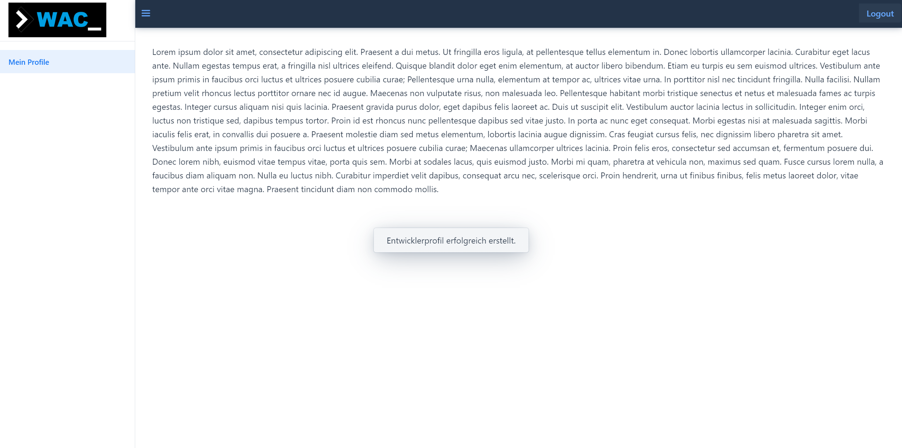

## Eingegangene Kundenprojekt-Anfragen einsehen und beantworten

Mögliche Anfragen zu bestimmten Kundenprojekten kann man im Reiter "**Projektanfragen**" des Seiten-Menüs verwaltet werden:
Durch Klick auf die jeweilige Zeile dieser Tabelle werden Details zu dem Projekt sowie den zuweisenden Reviewer sichtbar.
Durch Klick auf Annehmen bzw. Ablehnen können Anfragen angenommen bzw. abgelehnt werden. Nur offene bzw. angenommene Anfragen
werden hier angezeigt.

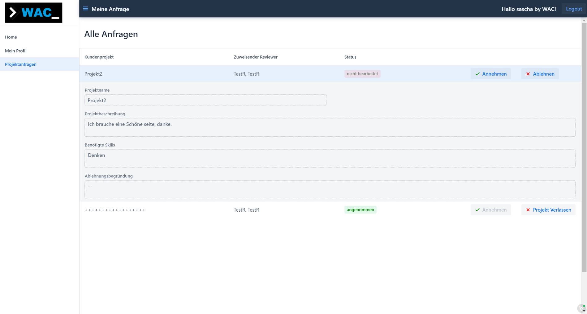

# Funktionalitäten in der Rolle des _Projekt Managers_

# Erstellen eines Kundenprojekts und Verwalten von erstellten Projekten
Um ein neues Kundenprojekt anzulegen wählen Sie den Reiter "Neues Projekt erstellen" im Seiten-Menü. Nach Eingabe des Projektnamens, der erforderlichen Skills für potenzielle Entwickler
und der beschreibung des Projekts können Sie zusätzlich wählen, ob das Projekt veröffentlicht werden soll und so Reviewern zur Verfügung steht.

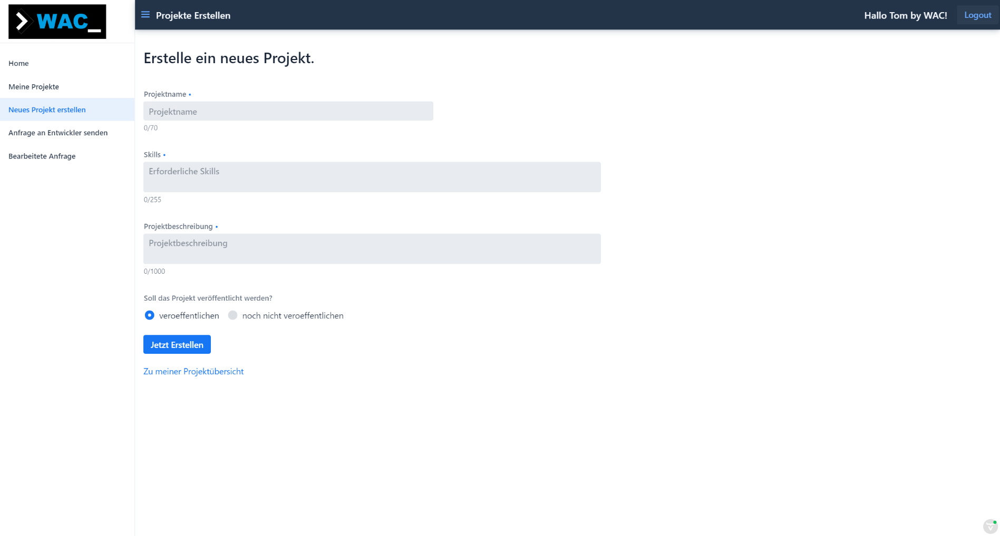

Bereits erstellte Kundenprojekte können im Reiter "**Meine Projekte**" eingesehen werden. Durch Klick in der Spalte "Kundenprojekt bearbeiten" kann das entsprechende Projekt bearbeitet und ggf. nachträglich veröffentlicht / oder auf nicht öffentlich gestellt werden.

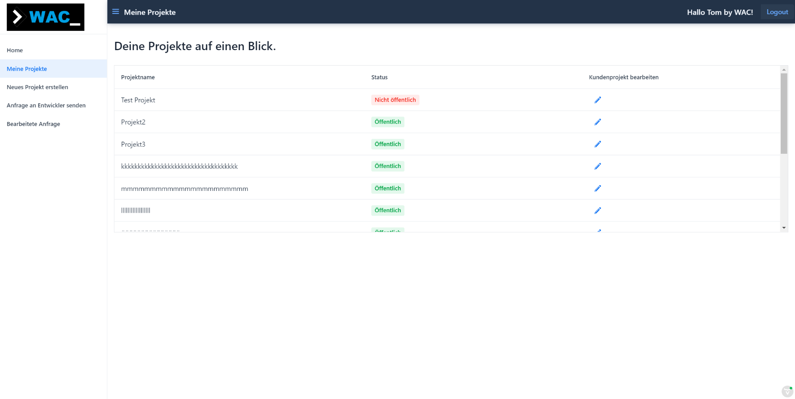

## Zu einem Kundenprojekt zugewiesene Entwickler einsehen

Nutzer in der Rolle eines Reviewers können Entwickler zu öffentlichen Kundenprojekten zuweisen bzw. vorschlagen.
Als Projekt Manager hat man nun die Möglichkeit diese vorgeschlagenen Entwickler (bzw. deren Profile) einzusehen und diesen
Anfragen für eine Zusammenarbeit in dem entsprechenden Projekt zu schicken.

Durch Auswahl des Reiters "**Anfrage an Entwickler senden**" erhalten Sie eine Übersicht aller Vorschläge von Entwicklern zu bestimmten Projekten.
Die Buttons der letzten Spalte erlauben die Annahme des Vorschlags (Versenden einer Anfrage an den zugewiesenen Entwickler), das Ablehnen eines
Vorschlags (d. h. Löschen der Anfrage) sowie die Ansicht des Profils des Entwicklers.
Beachten Sie, dass diese Seite nur Vorschläge anzeigt, die nicht abgelehnt wurden.

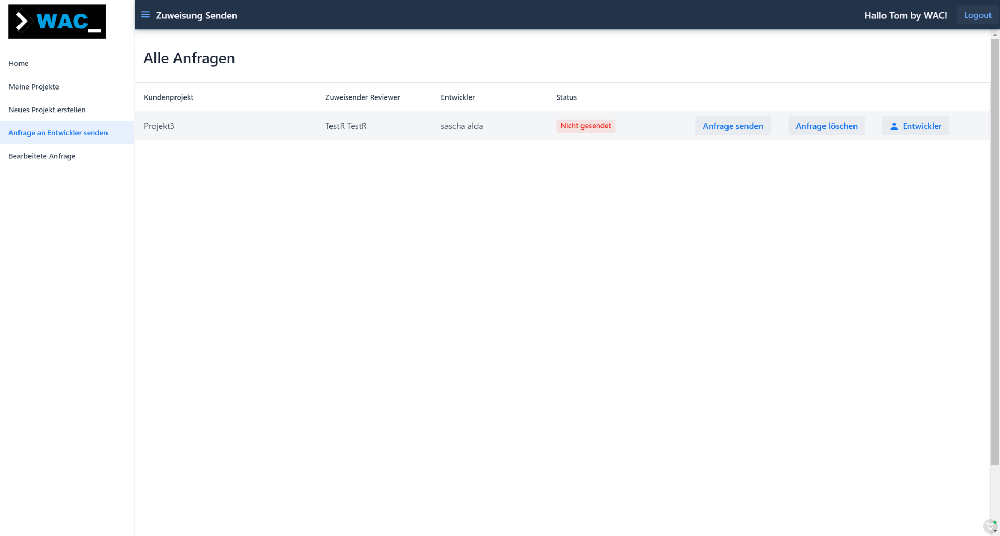

## Den Status versendeter Anfragen einsehen

Ob der jeweilige Entwickler eine versendete Anfrage angenommen oder abgelehnt oder noch nicht beantwortet hat kann im Reiter
"**Bearbeitete Anfragen**" eingesehen werden. Durch Klick auf die jeweilige Zeile können zusätzlich Details zum betreffenden Projekt
sowie im Falle einer Ablehnung der Anfrage durch den Entwickler den Grund für die Ablehnung eingesehen werden.

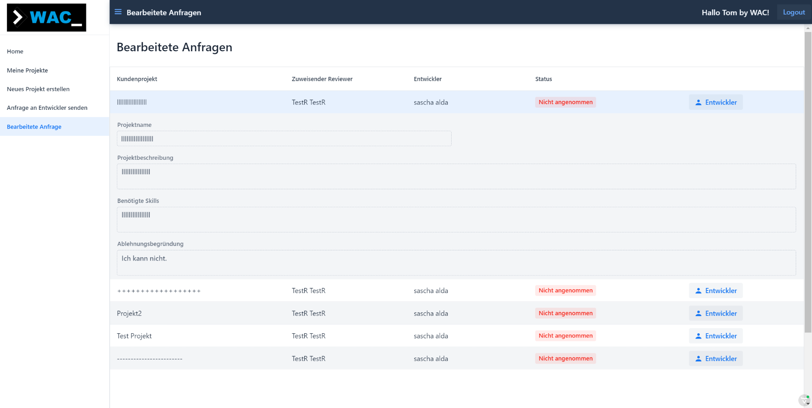

# Funktionalitäten in der Rolle des _Reviewers_

# Öffentliche Kundenprojekte einsehen

Einer Übersicht der öffentlichen Kundenprojekte finden Sie im Reiter "**Kundenprojekte**".

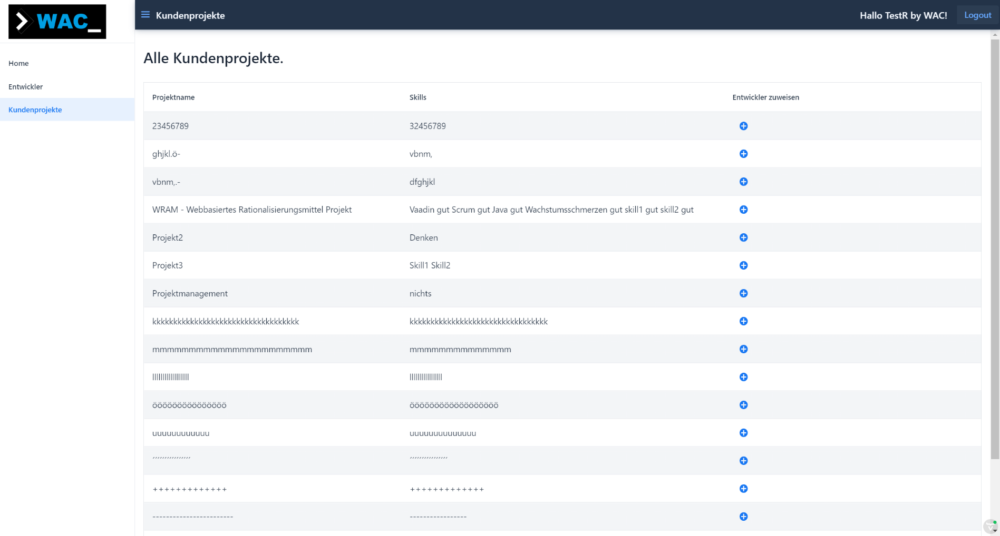

Durch Klick auf das Icon der letzten Spalte erfolgt eine Weiterleitung zu einer Unterseite auf der die Projekt-Details sowie
darunter eine Tabelle der verfügbaren Entwickler angezeigt. Durch Klicken der "**Anfrage versenden**" Buttons wird eine Anfrage
zu dem dort angezeigten Kundenprojekt an den ausgewählten Entwickler verschickt.

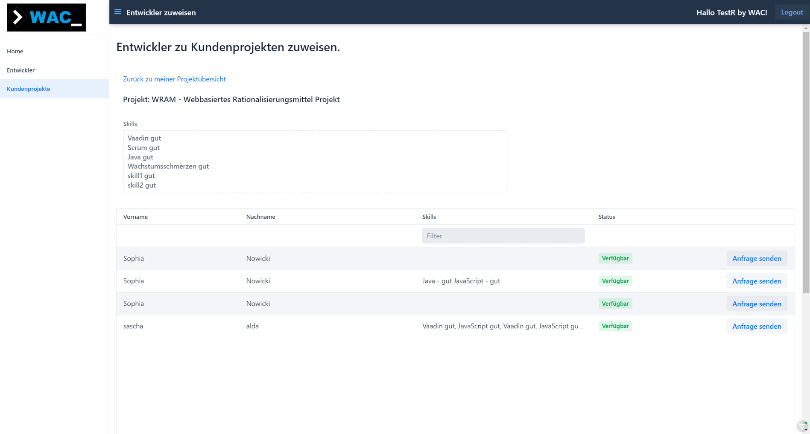

Beachten Sie, dass es der Entscheidung des Projekt Managers obliegt, ob der zugewiesene Entwickler eine Anfrage zur Zusammenarbeit
im jeweiligen Projekt erhält.

## Entwickler durch Angabe von Skills suchen

Eine Übersicht aller registrierten Entwickler mit Status dessen Verfügbarkeit (ob also Entwickler bereits einem Projekt zugewiesen sind) finden Sie im Reiter "**Entwickler**".
Durch Klick auf die jeweilige Zeile der Ergebnis-Tabelle erhalten Sie eine Detail-Ansicht der Profil-Angaben eines Entwicklers.

Durch Eingabe von Suchbegriffen, können die Ergebnisse anhand der Skill-Beschreibungen gefiltert werden.

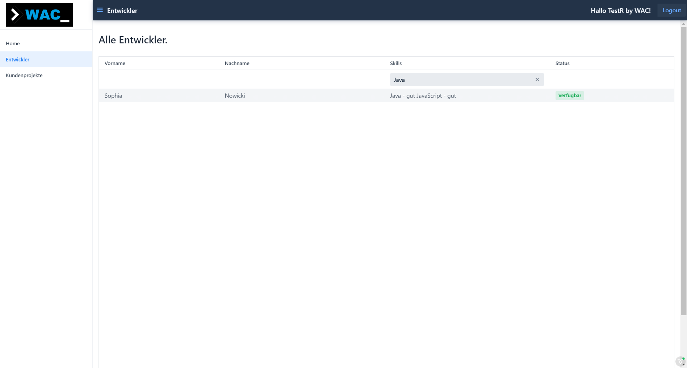

