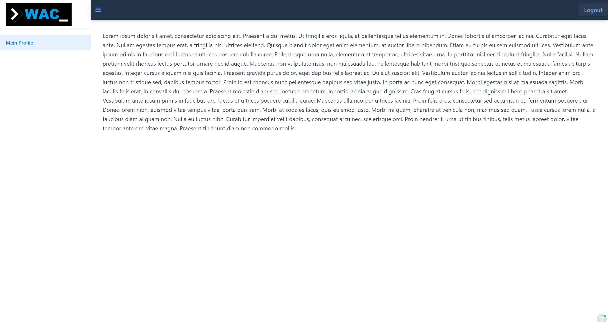

# Benutzer-Dokumentation der Funktionalitäten

## US1 Registrierung und Rollen
Auf der Startseite der Anwendung ist ein Link zur Registrierungsseite hinterlegt.

Die Registrierungsseite erlaubt die Eingabe von Vorname, Nachname, Username, E-Mail sowie die Wahl
der Nutzerrolle (hier Entwickler):

Das Passwort wird dabei auf Übereinstimmung geprüft.

Nach Eingabe aller Felder und Klicken des "Jetzt Registrieren"-Buttons ist die Registrierung erfolgreich.

## US2 Login
Der Login erfolgt auf der Hauptseite durch Eingabe des Username und des Passwortes.

Durch Bestätigung mit der Enter-Taste oder durch Klicken des "Log in"-Buttons ist man eingeloggt und wird auf seine
rollen-spezifische Start-Seite gelenkt. 
Der eingeloggte Benutzer ist Entwickler, sodass er aktuell nur ein Tab mit Namen "Mein Profile" im
linken Hamburger-Menu benutzen kann.

## US17 Entwickler Profil Erstellen (für Entwickler)

Da der aktuelle Benutzer sich als Entwickler registriert hat, kann er nun mit Klick auf den Tab "Mein Profile"
sein Profil erstellen bzw. ändern.

Wie im Screenshot sichtbar werden Daten, die bei der Registrierung angegeben wurden übernommen.
Die E-Mail kann als einziges Feld nicht nachträglich verändert werden.

# US18 Entwickler Profil bearbeiten (für Entwickler)

Wir betrachten nun das Bearbeiten eines Entwicklersprofil. Dem Nutzer ist es möglich alle Felder bis auf die E-Mail-Angabe
zu verändern. Weiterhin kann er/sie Skills als Textform anlegen und eine **Telefonnummer** hinzufügen. **Profilbild**

Die Telefonnummer wird dabei auf ein Vorkommen von Buchstaben geprüft: 

 
Nach Eingabe der Daten können wir nun das Profil abspeichern.

Wir werden bei erfolgreichem Speicher auf die individuelle Landing Page weitergeleitet und werden über das Update informiert:

Ein Navigieren auf "Mein Profile" zeigt die aktualisierten Daten:

